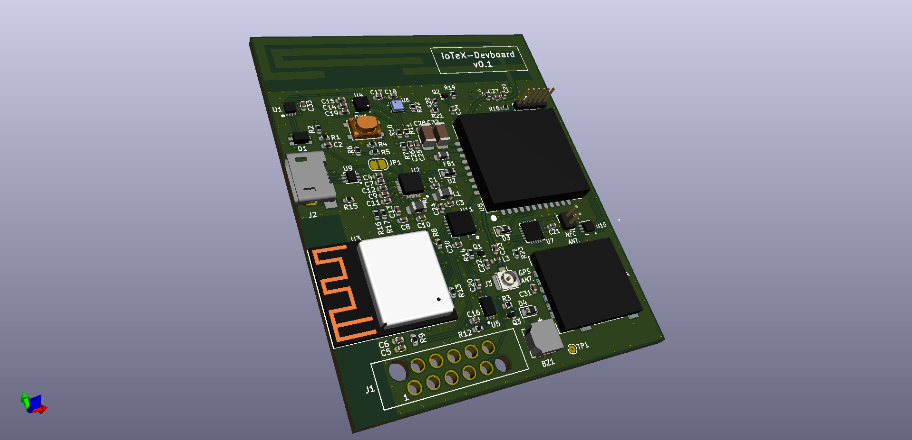
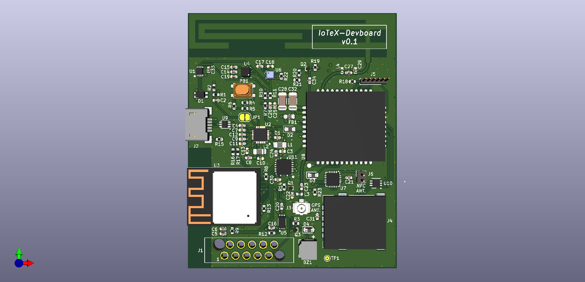
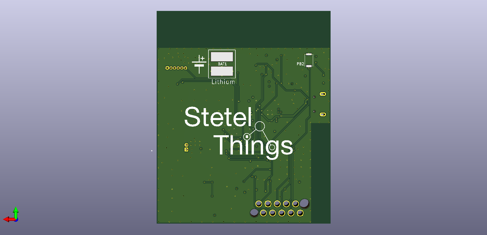

# IoTeX Devboard 

## Open Source ESP32-C3 Dev-Board “Powered by IoTeX”

Schematics, BOM and firmware examples for the IoTeX oriented Devboard

## In short

This Devboard aims to be the base for several IoTeX based device projects. 
The possibility to power it via a simple LiPo battery in addition to the Low power modes, the LPWAN module and blockchain enabled Secure Element makes it perfect for portable or handheld devices.

---

## PLAN
- [x] Phase 0: First Design schematics and route Pcb layout
- [ ] Phase 1: Build first prototype boards
- [ ] Phase 2: Smoke tests, Debugging, Troubleshooting and Test Firmware

---

## Board Features

### Radio Capabilities:
- NB-IoT and CAT-M
- Wifi 802.11n 2.4GHz
- Bluetooth LE 5
- GPS/GGSN with support for active antenna
- NFC (for the secure element only) - Antenna required

### Onboard Sensors
- Temperature
- Humidity 
- Pressure
- 3 Axis accelerometer
- light sensor
- On tactile button

### Onboard Actuators
- RGB Led
- Buzzer

### Computation capabilities
- RISC-V open source CPU up to 160MHz
- Crypto accelleration integrated in the CPU (SHA, RSA, HMAC)
- Special Secure Element for andvanced crypto functionalities (ECC, RSA, AES, DES etc.) enabling direct operations on the IoTeX blockchain.

### Power
- Special PMIC controls On/Off, power rails and Battery charging
- Power provided via micro-USB port (and/or LiPo battery)
- Several pheripherals can be switched off
- Processor supports different low power modes. 

### Other features
- Can be programmed via USB or UART (optionally OTA)
- Special Connector to allow easy connection to the programming lines
- Long press of On button allows a full hardware reset
- PCB LPWAN Antenna
- Can be programmed via Arduino (support not yet completed)

## The schematics
The current version of the [schematics](schematic/IoTex-Devboard.pdf) is completely open source and available under the Apache 2 License !

Under the same directory you can find the [KiCad](https://www.kicad.org/) schematic file.

You can take it, modify it and build any kind of DIY or commercial product from it.

---

## The Board PCB 

As of today the PCB is in the state of: **`ready for assembling`**

Note: the current PCB layout is not part of the open source license. However if you are familiar with KiCad then you can take the Kicad schematic file, modify it for your needs and re-route the layout.

### Rendering Front

### Rendering Back

